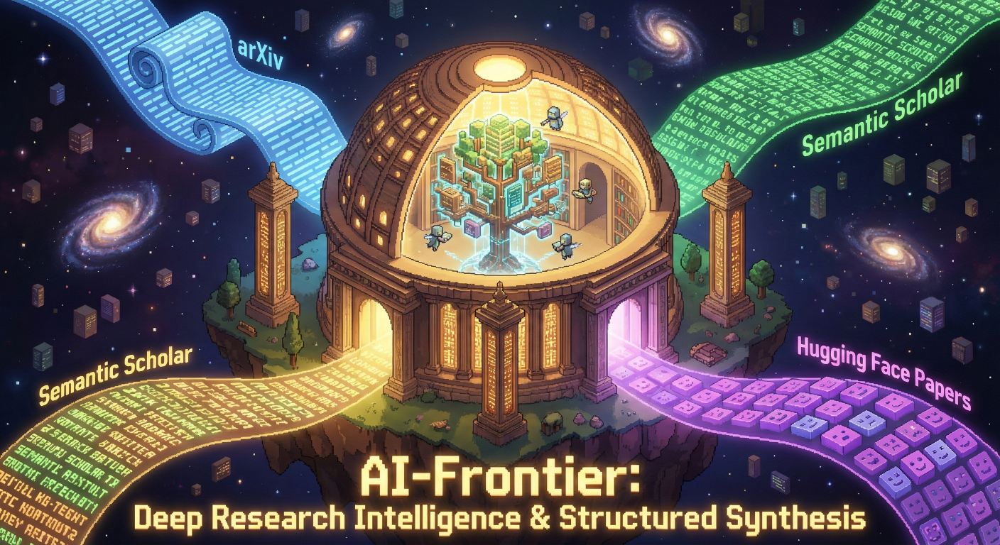

<p align="center">
  
</p>

<p align="center">
  <a href="https://github.com/flight505/ai-frontier"></a>
  <a href="LICENSE"></a>
  <a href="https://github.com/anthropics/claude-code"></a>
</p>

<p align="center">
  <strong>Deep research intelligence for Claude Code</strong><br>
  Access, understand, and apply SOTA scientific research from arXiv, Semantic Scholar, and Hugging Face Papers
</p>

---

A Claude Code plugin that gives Claude and agents structured access to the scientific research frontier. Optimized for LLM consumption: structured synthesis, not raw search results.

## Features

- **3 Data Sources** — arXiv, Semantic Scholar, Hugging Face Papers (all free, no API keys)
- **4 Synthesis Agents** — literature review, method comparison, implementation guidance, architecture evaluation
- **LLM-Optimized Output** — structured sections Claude can reason over
- **Zero Config** — no API keys, no setup, just install and use

## Install

```bash
claude plugin marketplace add flight505/flight505-marketplace
claude plugin install ai-frontier
```

## Skills

| Skill | Purpose |
|-------|---------|
| `arxiv-search` | Search arXiv preprints (cs.AI, cs.LG, cs.CL, cs.CV, stat.ML) |
| `semantic-scholar-search` | Search 200M+ papers with TLDRs, citations, influence scores |
| `hf-papers-search` | Search HF Papers with AI summaries, keywords, and trending |

## Agents

| Agent | Use When |
|-------|----------|
| `architecture-evaluator` | "Is this architecture optimal? Evaluate against SOTA." |
| `literature-reviewer` | "What does the field know about X?" |
| `method-analyst` | "Should I use method X or Y?" |
| `implementation-guide` | "How do I implement X from this paper?" |

## How It Works

Claude automatically knows when to use research tools via the routing skill. When Claude encounters a research question, it:

1. **Routes** to the appropriate agent or skill
2. **Searches** across multiple academic sources
3. **Synthesizes** findings into structured knowledge
4. **Returns** LLM-optimized output for reasoning

## Requirements

- Claude Code CLI
- Node.js 18+ (for built-in `fetch()`)
- Python 3 (for hook validators)

## License

MIT
